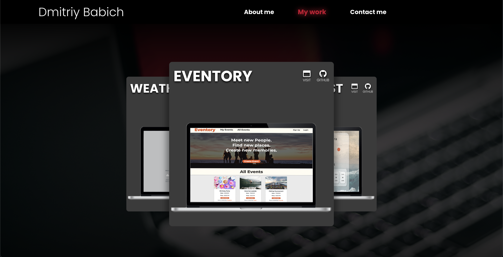

# React Portfolio

## Description 

This is a new version of my portfolio website built with react. It has 6 of my most recent applications. The nav links stay active when you are on their page. The contacts page has a form to fill out and several icons for my social pages and to view my resume.

## Table of Content
1. [Description](#description)
2. [Website](#installation)
5. [Questions](#questions)
6. [Licencse](#license)

## Website 
[React Portfolio](https://dimavich.github.io/React-portfolio/)

## Questions 
**If You have any questions you may contact me below:**
- [Git Hub](https://github.com/Dimavich)
- My Email: dmitriy.babich0@gmail.com

## License 
This is licensed under the mit License. More license information can be found here: [License Information](https://docs.github.com/en/github/creating-cloning-and-archiving-repositories/licensing-a-repository)